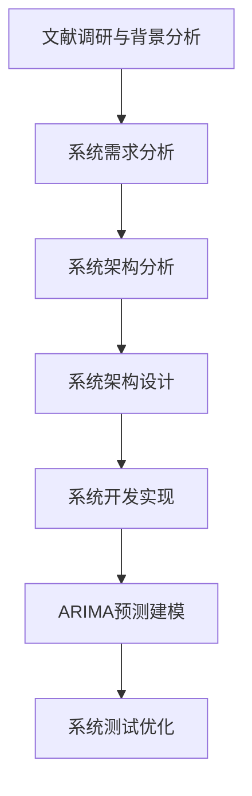
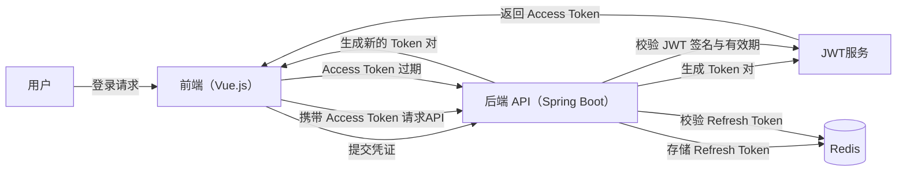

## 图1-1

```mermaid
graph TD
    A[文献调研与背景分析] --> B[系统需求分析]
    B --> C[系统架构分析]
    C --> D[系统架构设计]
    D --> E[系统开发实现]
    E --> F[ARIMA预测建模]
    F --> G[系统测试优化]
```

## 图2-1

```mermaid
graph LR
  User[用户] -- 登录请求 --> Vue[前端（Vue.js）]
  Vue -- 提交凭证 --> API[后端 API（Spring Boot）]
  API -- 生成 Token 对 --> JWT[JWT服务]
  API -- 存储 Refresh Token --> Redis[(Redis)]
  JWT -- 返回 Access Token --> Vue
  Vue -- 携带 Access Token 请求API --> API
  API -- 校验 JWT 签名与有效期 --> JWT
  Vue -- Access Token 过期 --> API
  API -- 校验 Refresh Token --> Redis
  API -- 生成新的 Token 对 --> Vue

```

